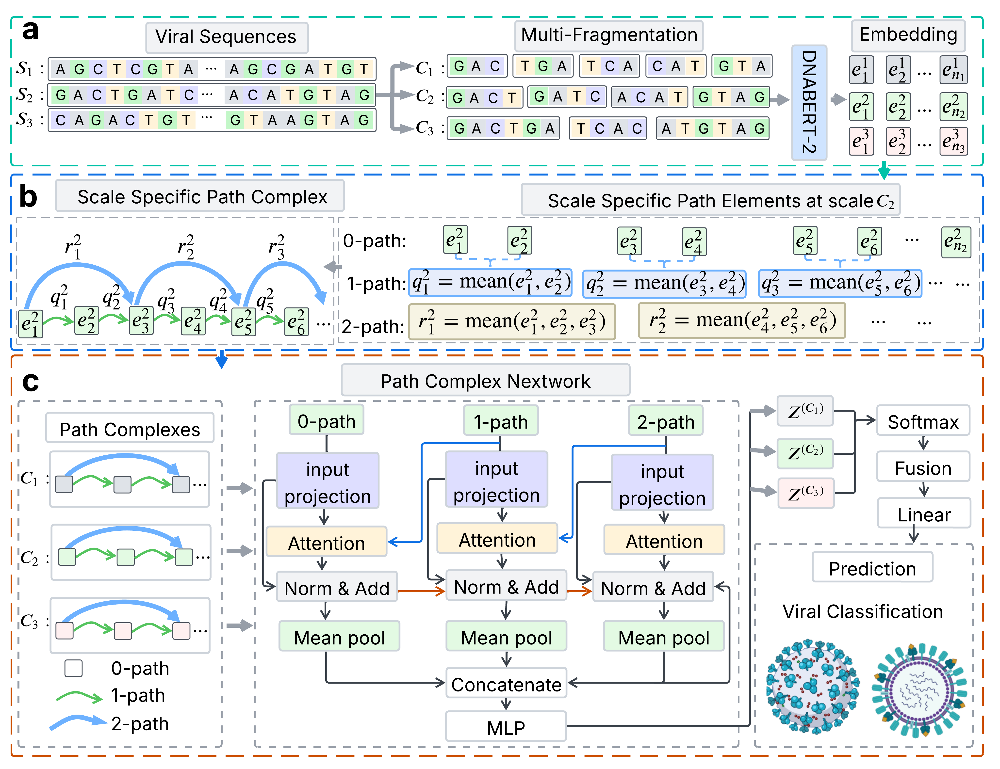

# Fragment Path Complex Networks (FPCN)

FPCN is a multiscale framework for viral family classification. 

## FPCN architecture




## Repository structure

```text
FPCN/
├── main.py                         # Training and evaluation entry point
├── prepare.py                      # Multiscale feature generation
└── src/
    ├── data/                       # Dataset metadata and FASTA files
    ├── evaluation/                 # Ensemble and summary utilities
    ├── model/                      # FPCN model
    ├── tasks/                      # Benchmark, internal-CV and temporal tasks
    ├── topo/                       # Ordered path-complex construction
    ├── prepare_data.py
    ├── prepare_raw.py
    └── utils.py
```

## Requirements

Install the core Python dependencies in your environment:

```bash
python -m pip install --upgrade pip setuptools wheel

python -m pip install numpy==1.26.4 pandas==2.2.2 scipy==1.13.1 scikit-learn==1.4.2 h5py==3.11.0 biopython==1.84 tqdm==4.66.4
python -m pip install matplotlib==3.10.0 seaborn==0.13.2 ete3==3.1.3
python -m pip install --upgrade torch torchvision torchaudio --index-url https://download.pytorch.org/whl/cu121
python -m pip install regex==2026.9.10 transformers==5.4.0 multimolecule==0.2.1 accelerate einops sentencepiece
python -m pip install torch-geometric openpyxl
```

## Data preparation 

Place each dataset's metadata and FASTA files in `src/data/` using the filenames defined in `src/prepare_data.py`. For example:

```text
src/data/
├── NCBI_record_valid_nucleotide.csv
└── NCBI_record_valid_nucleotide.fasta
```

The accession identifiers in the metadata and FASTA files must match. The default label column used for classification is `Family`.

## Feature generation
```bash
python -u prepare.py \
  --dataset NCBI_record_valid_nucleotide \
  --output-dir ./features_2024_multi_15_17_21_23 \
  --multiscale-fixed-fragment-counts "15,17,21,23" \
  --batch-size 4 \
  --device cuda
```

Fragment counts must be comma-separated. Feature files are written to:

```text
features_2024_multi_15_17_21_23/NCBI_record_valid_nucleotide/
```

## Model training

Train FPCN on one benchmark dataset with:
### Benchmark datasets
```bash
python -u main.py deep_viral_classification \
  --dataset NCBI_record_valid_nucleotide \
  --feature-root ./features_2024_multi_15_17_21_23 \
  --output-dir ./results/deep_viral_classification \
  --checkpoint-dir ./checkpoints \
  --model-seed 42 \
  --split-seed 42
```

## Data availability

The original viral genome records were obtained from the [NCBI Virus database](https://www.ncbi.nlm.nih.gov/labs/virus/vssi/). Preprocessed NCBI benchmark datasets are available from [Zenodo record 19655917](https://zenodo.org/records/19655917). Processed NCBI 2026 datasets are available from [Zenodo record 22849345](https://zenodo.org/records/22849345).

## Citation

If you use FPCN, please cite the associated manuscript. Citation details will be added when the paper becomes available.

